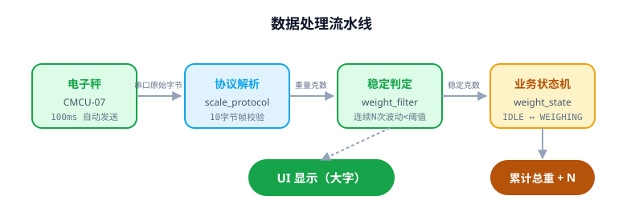
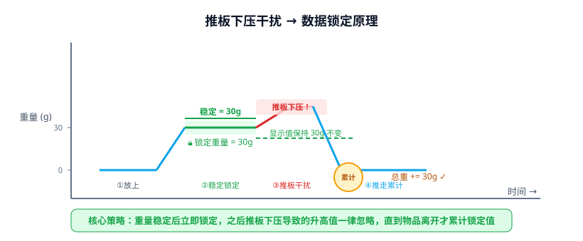
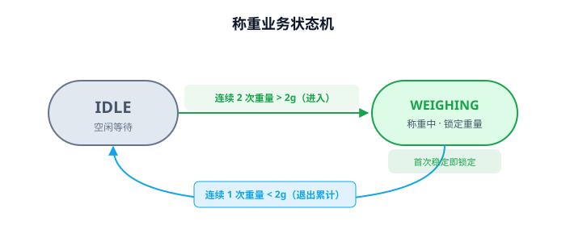
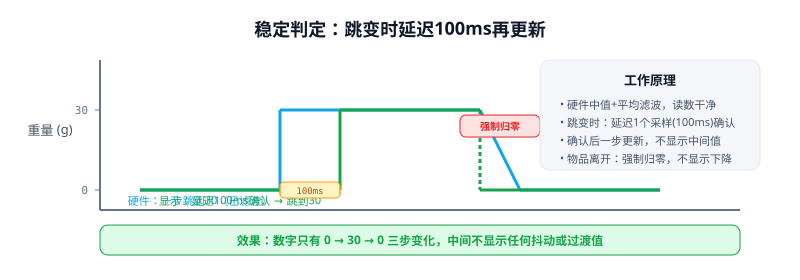
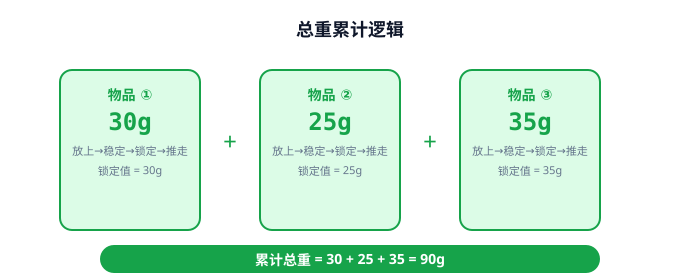
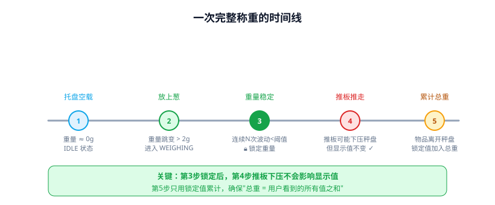
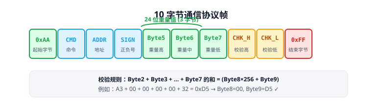

# Fisher_scallions_weight — 大葱称重上位机

> 北京交通大学 · 慧鱼机创赛项目 · 适配 1kg 量程 HX711 TTL 变送器电子秤

一套专为大葱自动分拣场景设计的称重上位机软件。连接电子秤后，实时显示重量、自动累计总重，**核心亮点是能抵抗推板下压干扰，确保每次累计的都是准确的净重**。



---

## 1. 这个项目解决什么问题？

### 场景背景

在大葱自动分拣生产线上，流程是这样的：

1. 一根大葱掉落到电子秤托盘上
2. 传感器检测到重量 → 软件记录
3. 推板把大葱从秤上推走，进入对应分拣箱
4. 下一根大葱继续...

**难点**：推板在推走大葱时，往往会**下压到秤盘**，导致电子秤的读数短暂飙升（比如从 30g 突然跳到 50g）。如果不做特殊处理，累计总重就会出错。

### 本软件的解决思路

**"稳定后立即锁定"** —— 大葱放上秤后，重量稳定下来的一瞬间，软件就把这个值锁定住。之后不管推板怎么下压，显示值和累计值都不会变，直到大葱被推走、重量归零时，才把锁定的值加到总重里。

打个比方：就像你用笔在纸上记了一个数字，不管之后秤上发生什么，纸上记的那个数字不会变。

---

## 2. 核心特性

| 特性 | 说明 |
|------|------|
| **🔒 数据锁定** | 重量稳定后立即锁定，推板下压不影响已锁定的值 |
| **📊 自动累计** | 每件物品离开秤盘时，把锁定值自动加到总重 |
| **🛡️ 抗干扰** | 连续多次判定机制，防止偶发抖动误触发 |
| **🎯 只显示稳定值** | 硬件已滤波，软件再做稳定确认，UI 数字干净不跳变 |
| **🔌 断开自动重连** | USB 松动后自动恢复，最多 30 次重试 + 瞬时错误容忍 |
| **🎨 数字颜色跟随** | 稳定时绿色、变化时浅绿，一眼看出数据状态 |
| **🧪 虚拟测试模式** | 不需要硬件，走完整代码路径调试验证 |
| **🎨 Apple 风格 UI** | 气泡粒子背景 + Toast 通知 + 平滑数字动画 |
| **📦 一键打包** | PyInstaller 打包成单 exe，目标电脑无需安装 Python |

---

## 3. 核心原理解析

### 3.1 推板下压干扰 → 数据锁定

这是本项目最核心的设计。看图就懂：



**分步解释**：

| 阶段 | 发生了什么 | 软件在做什么 |
|------|-----------|-------------|
| ① 放上 | 大葱掉到秤盘上，重量从 0 跳到实际值（硬件已滤波，读数干净） | 从 IDLE 状态检测到重量超过阈值，进入 WEIGHING 状态 |
| ② 稳定 | 重量不再跳动，稳定在某个值（比如 30g） | 确认稳定后 **锁定这个值**（locked_weight = 30g） |
| ③ 推板下压 | 推板推走大葱时下压秤盘，读数飙升到 40g+ | **显示值保持 30g 不变**，忽略飙升值 |
| ④ 推走累计 | 大葱离开秤盘，重量归零 | 把锁定的 30g 加到累计总重，回到 IDLE |

**如果没有数据锁定会怎样？**

推板下压时，读数从 30g 飙到 40g，如果直接累计这个值，总重就会多出 10g 的误差。累积几十根葱后，误差可能达到几公斤。

### 3.2 称重业务状态机

软件内部用一个简单的"两状态"状态机来管理整个称重流程：



- **IDLE（空闲）**：等待物品放上。需要连续 2 次读数超过 2g 才认为"真的有东西"，防止空气流动或轻微震动误触发。
- **WEIGHING（称重中）**：物品在秤上（重量 > 2g）。首次稳定后锁定重量，之后持续监控物品是否离开。连续 1 次读数低于 2g 就认为物品已离开。

> 注意：只有重量超过 2g 才会进入 WEIGHING 状态并触发锁定。如果放上的物品太轻（如 0.5g），软件不会识别为一次称重事件。

### 3.3 稳定判定：UI 数字干净不跳变

电子秤硬件已经内置了**中值滤波(3) + 平均滤波(3)**，所以软件拿到的原始读数已经是干净的值（硬件一步到位输出，不会逐级爬升）。软件只需要做两件事：

**① 跳变时延迟 1 个采样（100ms）再更新**

放上物品时，硬件读数从 0 一步跳到 30g。软件收到 30g 后不立即更新显示，而是等下一个采样确认"新值附近波动不超过 1g"，才把显示更新到 30。这 100ms 的延迟过滤掉偶然的瞬时跳变。

**② 物品离开时强制归零**

状态机判断物品已离开秤盘后，直接把显示强制设为 0，不显示下降过程。



这样 UI 上的数字只有"0 → 30 → 0"三步变化，干净利落。

### 3.4 总重累计逻辑

每次物品完成"放上→稳定→锁定→推走"的完整流程后，软件把**锁定的值**（而不是推板下压后的错误值）加到总重：



- 第 1 根葱：锁定 30g → 总重 = 30g
- 第 2 根葱：锁定 25g → 总重 = 55g
- 第 3 根葱：锁定 35g → 总重 = 90g

**关键点**：每次加到总重里的，都是物品稳定时的真实重量，不受推板下压影响。

### 3.5 一次完整称重的时间线

把上面的所有逻辑串起来，一根葱从放上到推走的完整过程：



整个过程在 1-2 秒内完成，全自动，不需要人工干预。

---

## 3.6 更多特色功能

### 🔌 串口断开自动重连

比赛现场或产线上，USB 线被碰到松动是常事。本软件不会因此"挂掉"，而是自动尝试恢复：

```
设备意外断开 → Toast 警告 → 自动开始重连 → 最多尝试 30 次（约 60 秒）
                                    ↓
                        每次重连时自动刷新端口列表
                        （检测 USB 是否重新出现）
                                    ↓
                    成功 → 自动连接 + "重连成功"提示
                    失败 → 恢复按钮，用户可手动操作
```

同时，软件还有**瞬时错误容忍**机制：USB 通信偶尔会有偶发抖动，软件不会一报错就断开，而是连续 3 次读取失败才判定"连接丢失"。避免了不必要的断线。

**用户感受**：线松了一下又插回去，软件自己就恢复了，不需要重启程序。

### 🎨 数字颜色跟随

重量数字不是静态的——它会用颜色告诉你当前状态：

| 状态 | 颜色 | 说明 |
|------|------|------|
| 稳定不变 | 祖母绿 🟢 | 数据可靠，可以放心读取 |
| 正在变化 | 浅亮绿 💚 | 数字在更新中（如放上/拿开物品时） |

配合 ease-out 平滑动画（约 400ms），数字不是生硬跳变，而是先快后慢地过渡到新值。用户一眼就能看出"数据现在稳不稳"。

### 🧪 虚拟测试模式详解

不需要任何硬件，就能完整调试验证软件的所有业务逻辑。开启后，软件内部会创建一个虚拟电子秤，按固定周期生成**完全符合真实协议的 10 字节帧**：

```
时间线：
0s ──── 4s：0g（空载，IDLE 状态）
4s ─── 10s：30g（模拟放上物品，进入 WEIGHING，稳定锁定）
10s ── 16s：0g（模拟物品离开，累计到总重）
16s ── 20s：0g（循环重复...）
```

**关键点**：虚拟模式不是"模拟 UI 效果"，而是从最底层开始走完整代码路径：

```
虚拟驱动生成 10 字节帧 → 协议层解析校验 → 稳定判定 → 状态机切换 → 锁定重量 → 累计总重 → UI 更新
```

也就是说，你在虚拟模式下验证过的逻辑，接上真实电子秤后完全一样。适合开发、调试、演示，也适合在没有硬件的环境下给别人展示软件功能。

开启方法：编辑 `config.py`，把 `SIMULATE_MODE_DEFAULT` 改为 `True` 即可。

---

## 4. 硬件部分

### 4.1 电子秤

- **型号**：CMCU-07 称重变送器（TTL 自定义协议 V3.70，1kg 量程，HX711 ADC）
- **淘宝链接**：[数字称重变送器 RS485通信MODBUS PLC称重传感器TTL电子秤HX711](https://e.tb.cn/h.R6j4l2jhcZqXUPw?tk=iW6y5zC84vT)
- **通信**：TTL 电平（3.3-5.5V），波特率 9600
- **接线**：

```
压力传感器 ──E+/E-/S+/S-──> CMCU-07 变送器
CMCU-07 ──VCC/GND/TXD/RXD──> CH340 USB转TTL ──USB──> PC
```

> 注意：TTL 串口线需要**交叉连接**（变送器 TXD → CH340 RXD，变送器 RXD → CH340 TXD）。**不能直接接 RS232**，会烧坏。

### 4.2 通信协议

电子秤每 100ms 自动发送一帧数据，每帧 10 个字节：



软件收到数据后，先校验帧是否正确，再提取 24 位重量值，最后乘以分辨率（默认 1g/刻度）得到实际克数。

### 4.3 电子秤自动发送模式

本软件连接电子秤后，会**自动开启电子秤的自动发送模式**（协议第 12 条指令）。开启后，电子秤每隔 100ms 主动向电脑发送一帧重量数据，**不需要软件主动去读**。

**为什么用自动发送模式，而不是让软件去读？**

| 方式 | 说明 | 缺点 |
|------|------|------|
| 软件主动读 | 软件每隔一段时间发指令问"现在多重" | 读得太快 → 电子秤来不及响应；读得太慢 → 漏数据。节奏不好掌握 |
| **自动发送**（本软件采用） | 电子秤自己按固定间隔推送数据 | 电子秤内部有精确的 100ms 定时器，节奏稳定，软件只需接收即可 |

**自动发送模式的好处**：
- **不丢数据**：电子秤主动推送，软件只管接收，不会因为读得太慢漏掉重量变化
- **节奏稳定**：每 100ms 一帧，软件 UI 刷新周期也设为 100ms，完美对齐
- **软件简单**：不需要设计复杂的读数据逻辑，专注于数据处理和业务逻辑
- **响应快**：100ms 间隔意味着最多延迟 100ms 就能感知到重量变化

> 自动发送模式在每次连接时自动开启，用户不需要手动操作。断开连接或去皮操作期间，软件会先停止自动发送，等去皮完成后再重新启动，确保不会收到旧数据。

---

## 5. 安装与运行

### 5.1 环境要求

- **Python 3.8 或以上**（3.8、3.9、3.10、3.11、3.12 都行）
- **操作系统**：Windows（macOS/Linux 也能跑，只是管理员权限那块只有 Windows 有效）
- **硬件**：CH340 USB 转 TTL 模块 + 电子秤（如果只想在电脑上调试，可以不开硬件，用虚拟模式）

### 5.2 安装

```bash
# 1. 克隆或下载本项目
# 2. 安装依赖
pip install -r requirements.txt
```

就这两步，依赖只有 pyserial（串口通信）和 pyinstaller（打包用）。

### 5.3 启动

```bash
python main.py
```

Windows 上首次启动会自动请求管理员权限（UAC 弹窗），这是为了正常访问串口和大屏显示。

### 5.4 虚拟测试模式

如果你暂时没硬件，可以打开虚拟模式来调试——具体原理和效果见 §3.6。快速开启：

1. 编辑 `config.py`，将 `SIMULATE_MODE_DEFAULT` 改为 `True`
2. 运行 `python main.py`
3. 点"连接"，软件自动模拟称重数据循环
4. 调试完成后改回 `False`

---

## 6. 电子秤首次设置

新买来的电子秤需要先用厂商提供的调试软件做一次初始设置，之后就不用管了。

> 这是一次性操作，参数永久保存在电子秤芯片里，断电也不丢失。

### 步骤

| 步骤 | 操作 | 目的 |
|------|------|------|
| ① 装驱动 | 运行 `电子秤资料/.../CH341SER.EXE` | 让电脑识别 CH340 模块 |
| ② 接线 | 按 §4.2 接线，打开厂商调试软件 | 建立通信 |
| ③ 零点校准 | 清空托盘 → 发送零点校准指令 | 把当前空载状态设为零点 |
| ④ 砝码校准 | 放 500g 砝码 → 发送砝码校准指令 | 让秤知道 500g 是多少 |
| ⑤ 验证 | 放砝码显示 ~500g，取下显示 ~0g | 确认校准成功 |

完成以上设置后，**以后只需要用本软件**，不再需要打开厂商调试软件。

> 本软件**不提供**零点校准和砝码校准功能——这些属于硬件级别设置，一次性做完就不用再做。本软件每次运行时只做"去皮"（临时清零，断电丢失），适配称重前可能存在的容器或托盘。

---

## 7. 使用流程（每次运行）

### 7.1 连接 & 自动去皮

1. 运行 `python main.py`
2. 选择串口号和波特率 → 点"连接"
3. 弹出 3 秒倒计时，确认托盘状态已稳定
4. 倒计时结束自动去皮（把当前重量视为 0）
5. 状态栏显示"已连接 · 已去皮"，开始工作

### 7.2 称重过程中

- 放上物品 → 数字从 0 一步跳到稳定值（比如 30g）
- 推板推走 → 数字立即归 0，同时总重自动 +30g
- 下一根继续...

### 7.3 手动操作

底部有两个按钮：

- **去皮（重新置零）**：中途换了容器后想重新计净重时点这个
- **取消去皮**：恢复去皮前的原始读数

---

## 8. 软件结构

项目按职责拆成 8 个文件，每个文件只做一件事：

| 文件 | 职责 | 对应图中 |
|------|------|---------|
| `config.py` | 所有可调参数（阈值、波特率、颜色等） | — |
| `scale_protocol.py` | 协议层：10 字节帧的构造、解析、校验 | 协议解析 |
| `scale_driver.py` | 驱动层：封装串口读写 + 虚拟模拟驱动 | 电子秤 |
| `weight_filter.py` | 稳定判定：跳变时延迟 1 个采样确认新值 | 稳定判定 |
| `weight_state.py` | 业务状态机：IDLE↔WEIGHING、锁定、累计 | 业务状态机 |
| `calibration.py` | 会话级操作：去皮 / 取消去皮 | — |
| `app.py` | UI：窗口、按钮、显示、粒子背景 | UI 显示 |
| `main.py` | 程序入口 | — |

---

## 9. 打包为单 exe

项目支持一键打包成独立 exe 文件，**分发给用户后，双击就能运行，不需要装 Python、不需要装任何依赖**。

```bash
# 打包
python build.py

# 产物：dist/葱称重系统.exe（约 11MB）
```

把 `葱称重系统.exe` 发给用户就行。首次运行可能弹出 Windows 安全提示，点"更多信息 → 仍要运行"即可。

---

## 10. 目录结构

```
Fisher_scallions_weight/
├── main.py                 # 程序入口
├── app.py                  # UI 界面
├── config.py               # 所有参数配置
├── scale_protocol.py       # 协议解析
├── scale_driver.py         # 串口驱动 + 虚拟驱动
├── weight_filter.py        # 稳定判定
├── weight_state.py         # 业务状态机
├── calibration.py          # 去皮操作
├── smooth_number.py        # 数字平滑动画
├── build.py                # 打包脚本
├── generate_diagrams.py    # 生成 SVG 插图（README 用）
├── requirements.txt        # 依赖列表
├── README.md               # 本文档
├── images/                 # README 嵌入的 SVG 图
│   ├── architecture.svg    # 数据流水线
│   ├── data_locking.svg    # 推板下压锁定原理
│   ├── state_machine.svg   # 状态机
│   ├── stable_judge.svg    # 稳定判定
│   ├── total_weight.svg    # 总重累计
│   ├── weighing_timeline.svg  # 称重时间线
│   └── protocol_frame.svg  # 协议帧格式
├── 电子秤资料/              # 厂商资料（不入库）
│   └── 称重变送器模块（TTL自定义协议）资料下载/
│       ├── 电子秤串口模块说明书.pdf
│       ├── 调试软件 V3.70.exe   ← 首次硬件设置用
│       └── ...
└── dist/                   # 打包产物（不入库）
    └── 葱称重系统.exe
```

---

## 11. 版本历史

- **v1**（已废弃）：旧电子秤 ASCII 协议
- **v2.1**：适配 1kg 量程 TTL 自定义协议，按层次拆分模块，新增虚拟测试模式
- **v2.2**：显示策略优化 —— 只在重量稳定确认后更新显示，UI 数字干净不跳变
- **v2.3**：曾尝试 SaaS 卡片风（已废弃）
- **v2.4**：恢复简洁布局，字体升级，优化稳定判定逻辑
- **v2.5**：校徽图片支持
- **v2.6**：PyInstaller 单文件打包支持
- **v2.7（本版）**：
  - **数据锁定机制**：重量稳定后立即锁定，推板下压不影响累计值
  - Apple 风格 UI 重设计：气泡粒子背景 + Toast 通知 + 平滑数字动画
  - 串口断开自动重连 + 线程安全
  - 连接监控 + 瞬时错误容忍（USB 抖动不立即断开）

---

## 12. 致谢

- 慧鱼机创赛组委会
- CMCU-07 变送器厂商提供的详细协议文档
